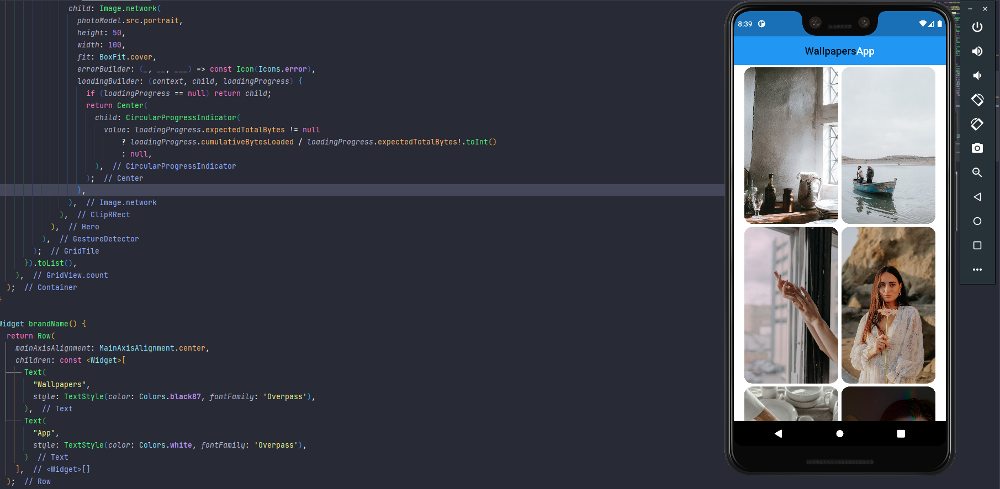
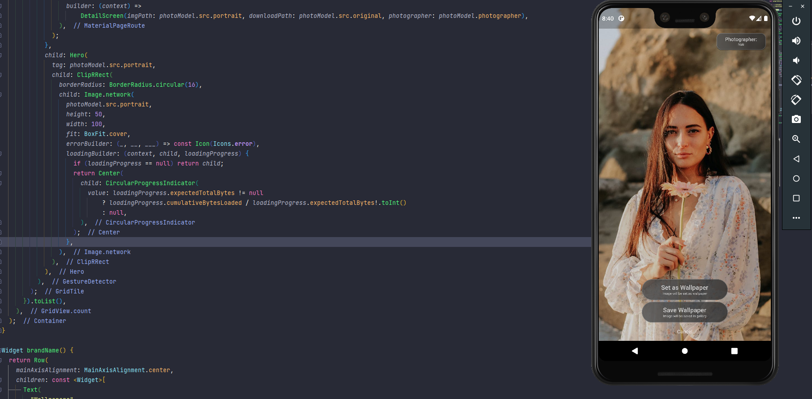
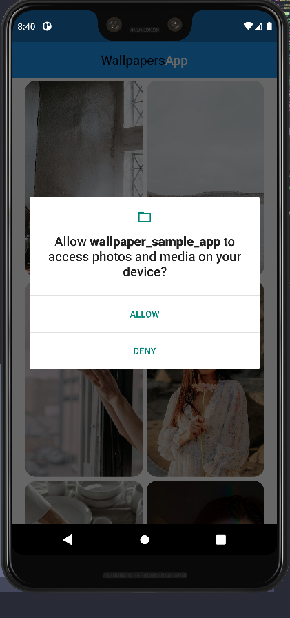
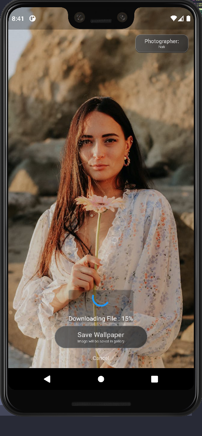

# wallpaper_sample_app

A Sample App For Setting Wallpaper

## Details

This project is a sample app for fetch data from an API and show it in a list.

We've used packages below for fetching data from API:

* http
* json_annotation
* url_launcher
* url_launcher_web
* dio

Then we used below packages for saving photos to gallery or setting them as wallpaper also handling required permission:

* image_gallery_saver
* permission_handler
* wallpaper

**NOTE**: THIS PROJECT DOESN'T CONTAIN ANY STATE MANAGEMENT SYSTEM FOR THE PURPOSE OF SIMPLICITY OF UNDERSTANDING ABOVE CONCEPTS

Screenshots:

